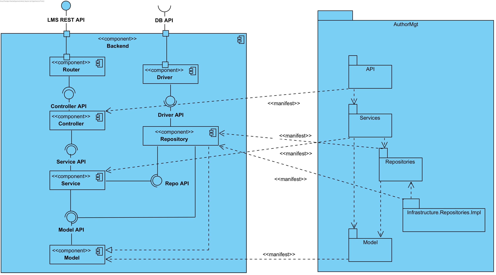
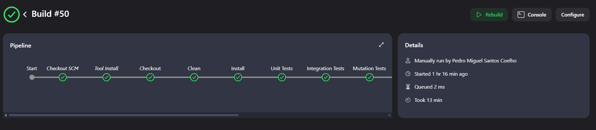
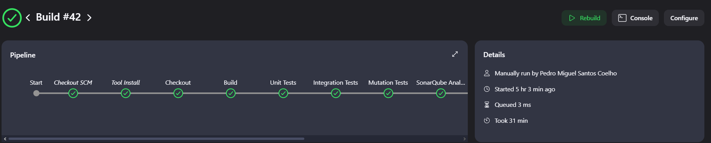

# Vistas
## Vistas de Implementação
# System as Is

### Vista de Implementacao Nivel 1

### Vista de Implementacao Nivel 2

### Vista de Implementacao Nivel 3

### Vista de Implementacao Nivel 4

---

## Vistas Lógicas
## System as Is

### Vista Lógica Nivel 1
!
### Vista Lógica Nivel 2

### Vista Lógica Nivel 3

---

## Vista Logica X Vista de Implementacao

---
# Architectural Software Requirements (ASR)

## Contexto do Sistema
O sistema é um serviço de backend REST para a gestão de uma biblioteca, com endpoints para gerir livros, géneros, autores, leitores e empréstimos. O foco deste projeto é implementar práticas de integração e entrega contínuas (CI/CD) para melhorar a eficiência do desenvolvimento e a qualidade do software.

## Problemas
A arquitetura atual do **Library Management Service (LMS)** apresenta limitações em várias áreas:

- **Variabilidade:** Dificuldades em adaptar o sistema a novas necessidades e cenários operacionais sem um esforço significativo.
- **Configurabilidade:** A incapacidade de modificar comportamentos e parâmetros em tempo de execução de maneira eficiente.
- **Confiabilidade:** Necessidade de melhorias na disponibilidade e recuperação do sistema em caso de falhas.
- **CI/CD:** Falta de um processo de automação bem definido para integração contínua e entrega contínua.
- **Testes:** Deficiências nas práticas de testes automatizados, o que compromete a deteção de falhas e a garantia da qualidade do software.

## Requisitos Funcionais
- **CI/CD:** O sistema deve adotar um processo de automação CI/CD utilizando o Jenkins, com as seguintes etapas:
    - **SCM:** Gestão de código fonte.
    - **Build:** Compilação e resolução de dependências.
    - **Artefato Criação:** Empacotamento de artefatos para distribuição.
    - **Análise de Código Estático:** Implementar ferramentas como ES Lint ou SonarQube.
    - **Testes Unitários:** Execução de diferentes níveis de testes separadamente, incluindo cobertura de teste e testes de mutação.
    - **Testes de Integração:** Testes em nível de serviço, incluindo testes de banco de dados.
    - **Relatórios:** Geração de relatórios dos resultados de testes.

- **Deployment:** O sistema deve permitir a implantação em ambientes:
    - Local.
    - Servidores remotos (ex: https://vs-ctl.dei.isep.ipp.pt).

- **Automação de Testes Funcionais:** O sistema deve melhorar os testes automatizados com:
    - Testes Opaque-box (classes de domínio).
    - Testes Transparent-box (classes de domínio).
    - Testes de Mutação (classes de domínio).
    - Testes de Aceitação.

## Requisitos Não Funcionais
- **Variabilidade:** O sistema deve ser projetado para suportar mudanças frequentes e adaptações sem necessidade de grandes reestruturações.

- **Configurabilidade:** O sistema deve permitir a configuração em tempo de execução, assegurando que alterações podem ser feitas rapidamente e sem interrupções.

- **Confiabilidade:** O sistema deve garantir alta disponibilidade e incluir mecanismos de recuperação para falhas, minimizando o impacto de problemas operacionais.

- **Desempenho da Pipeline:** Deve ser realizada uma análise crítica do desempenho da pipeline CI/CD, com evidências de melhorias ao longo do tempo, garantindo que o tempo de entrega e a qualidade do código sejam continuamente otimizados.

- **Segurança:** O sistema deve incluir práticas de segurança durante o processo de CI/CD, garantindo que o código e os dados estejam protegidos em todas as fases do desenvolvimento.

---

## Pipelines
#### De forma a adotar uma automatização de processos por CI/CD no Jenkins criamos 2 pipelines, uma para o Jenkins Local e uma para o Jenkins no DEI's remote server.

## Pipeline Local

##### Na pipeline local foram criadas 9 stages de forma a endereçar os problemas definidos pelo product owner

## Stages

### Checkout
    O stage Checkout é responsável por realizar a obtenção do código-fonte do repositório, garantindo que a pipeline tenha acesso à versão mais recente do projeto para execução dos próximos passos.
### Clean
    O stage Clean é responsável por executar a limpeza do projeto, removendo arquivos temporários e diretórios gerados em builds anteriores, garantindo um ambiente de build limpo e preparado para a próxima execução.
### Unit Tests
    O stage Unit Tests é responsável por executar apenas os testes unitários, garantindo que as funcionalidades do código sejam validadas isoladamente e que comportamentos esperados estejam corretos antes de prosseguir para as próximas etapas.

### Integration Tests
    O stage Integration Tests é responsável por executar os testes de integração, que verificam a interação entre diferentes módulos do sistema, garantindo que as partes do código funcionem corretamente quando integradas.

### Mutation Tests
    O stage Mutation Tests é responsável por executar testes de mutação, que avaliam a eficácia dos testes existentes ao introduzir mudanças controladas no código. Isso ajuda a identificar se os testes são robustos o suficiente para capturar falhas potenciais.

### SonarQube Analysis
    O stage SonarQube Analysis é responsável por executar a análise de qualidade do código com o SonarQube, identificando possíveis vulnerabilidades, problemas de segurança e verificando métricas de cobertura de testes. Isso ajuda a manter o código em conformidade com as melhores práticas e padrões de qualidade.

### Install
    Este stage é responsável por instalar as dependências e o projeto no repositório local, sem executar os testes. Ele prepara o ambiente para a criação do artefato final e para a execução de outras etapas.

### Package
    Este stage realiza a geração do artefato do projeto (por exemplo, um arquivo JAR), garantindo que o pacote esteja pronto para implantação, mas sem executar os testes, acelerando o processo de empacotamento.
### Run Application
    Este stage é responsável por iniciar a aplicação em segundo plano e realizar um health check para garantir que a aplicação foi iniciada corretamente. Ele inclui um tempo de espera para assegurar que a aplicação esteja totalmente carregada e faz uma solicitação para verificar se o servidor responde como esperado.

## Post
    Bloco success: Este bloco é executado quando o pipeline é concluído com sucesso, indicando que todas as etapas foram realizadas sem falhas. A mensagem "Build e testes concluídos com sucesso!" é exibida para confirmar o sucesso.

    Bloco failure: Este bloco é executado quando há uma falha em qualquer etapa do pipeline, informando que ocorreu um erro no build ou nos testes. A mensagem "Houve um erro no build ou nos testes." é exibida para sinalizar a falha.

## Pipeline na VM

##### Na pipeline local criamos 8 stages de forma a tentar enderaçar o máximo de requisitos possiveis. Ainda assim, por falta de recursos computacionais da VM acabamos por ver-mos a necessidade de reduzir alguns requisitos em prol da pipeline ser executada num tempo minimamente aceitável. Ainda assim, a mesma tem um tempo de executação acima do expectável.

### Checkout
    O stage Checkout é responsável por realizar a obtenção do código-fonte do repositório, garantindo que a pipeline tenha acesso à versão mais recente do projeto para execução dos próximos passos.
### Clean
    O stage Clean é responsável por executar a limpeza do projeto, removendo arquivos temporários e diretórios gerados em builds anteriores, garantindo um ambiente de build limpo e preparado para a próxima execução.
### Unit Tests
    O stage Unit Tests é responsável por executar apenas os testes unitários, garantindo que as funcionalidades do código sejam validadas isoladamente e que comportamentos esperados estejam corretos antes de prosseguir para as próximas etapas.

### Integration Tests
    O stage Integration Tests é responsável por executar os testes de integração, que verificam a interação entre diferentes módulos do sistema, garantindo que as partes do código funcionem corretamente quando integradas.

### Mutation Tests
    O stage Mutation Tests é responsável por executar testes de mutação, que avaliam a eficácia dos testes existentes ao introduzir mudanças controladas no código. Isso ajuda a identificar se os testes são robustos o suficiente para capturar falhas potenciais.

### Deploy
    Esta funcionalidade foi comentada em prol do tempo de execucao

### Install
    Este stage é responsável por instalar as dependências e o projeto no repositório local, sem executar os testes. Ele prepara o ambiente para a criação do artefato final e para a execução de outras etapas.

### Package
    Este stage realiza a geração do artefato do projeto (por exemplo, um arquivo JAR), garantindo que o pacote esteja pronto para implantação, mas sem executar os testes, acelerando o processo de empacotamento.

## Post
    Bloco success: Este bloco é executado quando o pipeline é concluído com sucesso, indicando que todas as etapas foram realizadas sem falhas. A mensagem "Build e testes concluídos com sucesso!" é exibida para confirmar o sucesso.

    Bloco failure: Este bloco é executado quando há uma falha em qualquer etapa do pipeline, informando que ocorreu um erro no build ou nos testes. A mensagem "Houve um erro no build ou nos testes." é exibida para sinalizar a falha.

## Critical analysis of the pipeline, including performance, with evidence of improvement over time

#### Ao longo da adaptação, melhora e criação de novos testes unitários e de integração vimos resultados positivos através da análise dos resultados dos testes de mutação.
#### Isso é possível ser visualizado através das imagens abaixo que foram retiradas através da utilização da JaCoCO para gerar reports sobre os testes unitários.

#### Numa primeira vez a realizar os testes de mutação obtivemos apenas uma line coverage de 60%, com uma taxa de mutações mortas de apenas 42%
#

#### Ao longo do tempo fomos melhorando e criando novos testes para testarem outros métodos dos modelos e fomos melhorando tanto a coverage como as mutações mortas
#

#### Terminamos então os testes com uma coverage 77% e 60% de mutações mortas. Apesar de não ser um resultado expectável é notavel uma progressão e melhoria dos testes. Com mais tempo, podia ser possível ter obtido resultados ainda mais positivos.

## Tempo de execução da Pipeline (Local)

####  A pipeline local tem um tempo de execução a rondar os 10-15 minutos, que nos parece aceitável tendo em conta a quantidade de operações que a mesma realiza e os resultados obtidos serem positivos. 

#### Este resultado fica ainda mais positivo quando vemos resultados positivos, onde a pipeline a executa as mesmas operações demorava cerca de 30 minutos a ser executada. Esta melhoria foi notável quando foi realizada a divisâo dos testes

## Tempo de execucao da Pipeline (VM)
#### Na VM, apesar do resultado ser significativamente melhor entre as primeiras tentativas e a ultíma, o tempo de execução de cerca de 45 minutos é insustentável e teria que ser melhorado. No primeiro momento em que tinhamos todas as funcionalidades obtinhamos um tempo médio de 2 horas

